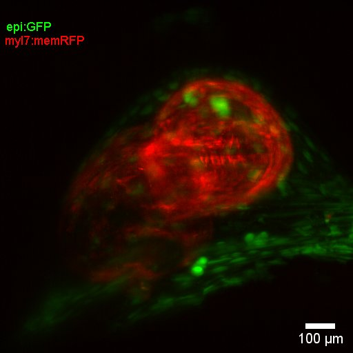

<!DOCTYPE html>
<html>
<head>
Processor_6D by Alexander Ernst
</head>
<body>

<h1> Processor_6D  </h1>

This Plugin for FIJI is made to facilitate browsing through   XYTCZL .lif datasets (T: frames C:Channels Z:slices, L: loops) datasets, using the virtual stack function. 
The ImageJ programming tutorial "https://www.ini.uzh.ch/~acardona/fiji-tutorial/" was taken as template to create an interactive controller for these 
complex datasets. The dialogs are non-blocking and with this the roi-manager can be used to perform some preliminary analysis.

 
Principle:
The .lif-files are opened with the bioformats importer as normal virtualstack, not hyperstack. 
The properties are read from the metadata and subsequently Channels and Slices are set to 1, while all dimensions
are put into the slices (T=T*C*Z*loops). A dialog is opened and the controller window based on an AdjustmentListener, will enable you to browse through the datasets.  The windows are kept separate, as our microscope is recording the two channels individually and in this sense the channels are not aligned. 

 
Application: 
The bioformats-importer does a great job with opening different datasets, but will not show more than 5 dimensions. 
This Plugin is made for the specific purpose of helping the users of the Leica DLS XYTZL mode to quickly browse their datasets.  
These files are usually large, for this reason the virtualstack function is used. Future versions will offer more processing functionalites.

 
Testdata can be provided on request, as the files are between 500 - 1500 gb big. 

 
Alexander Ernst
Institute of anatomy, University of Bern
Programmed in Jython, tested on FIJI: IJ.getVersion: 2.0.0-rc-69/1.52p   and java.version: 1.8.0_172

<h1> Installation </h1>

1. Simply copy Converter_6D and Processor_6D to your "FIJI/Plugins/" directory and restart FIJI. 
2. Start Processor_6D from inside FIJI in the Plugins tab.   

</body>
</html>
